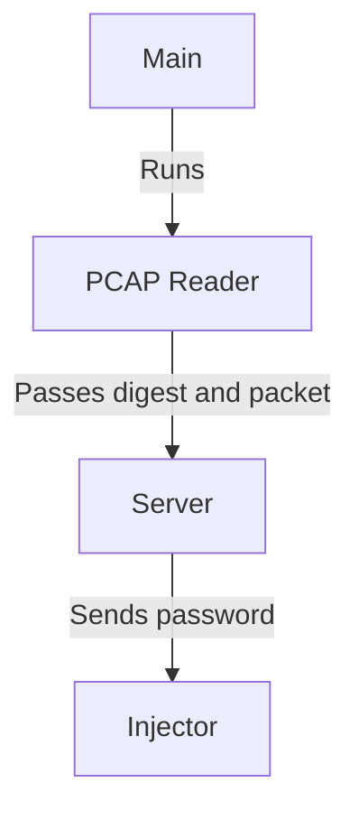

# Rip Hijacking

El repositorio contiene dos partes
- El docker que corre mininet
- Los códigos de python que se encargan de la inyección 

### Mininet
En el caso de mininet, solamente se necesita que la computadora para correrlo tenga docker y docker-compose. Y levantarlo por medio del siguiente comando:

> [!IMPORTANT]
> Hay que estar dentro del folder de mininet para ejecutar los comandos
 
> [!IMPORTANT]  
> El mininet se levanta en la misma computadora que el servidor. No necesita correr en los clientes (°_°).

```
docker compose up -d
```

y para bajarlo

```
docker compose down
```

> [!WARNING]
> Durante la primera vez que se descarga el repo, hay que obtener la captura de la topología para poder hacer la demostración
> ```docker exec -it ff-bruteforce-lab python3 /data/FF_BruteForce/topo.py```
> Se necesita tener el contenedor de mininet arriba, y esto va a generar dentro del folder el archivo `capture.pcap`

Despues de eso no hay que hacer nada dentro del mininet, más que tenerlo arriba antes de correr el servidor


### Entorno de Python

Los códigos de python (`client.py`, `main.py`, etc.) necesitan Python 3 (probado con 3.14, pero debería funcionar con otras versiones recientes mientras las libs en `requirements.txt` sean compatibles). Para no instalar las dependencias de forma global, hay que crear un entorno virtual (venv):

Primero verificar la versión de python instalada:

```
python3 --version
```

Crear el venv con esa versión:

```
python3 -m venv .venv
```

> [!NOTE]
> Si se tienen varias versiones instaladas y se quiere usar una en específico (ej. 3.14), se puede reemplazar `python3` por `python3.14` en el comando de arriba (`python3.14 -m venv .venv`)

Activarlo:

```
# macOS / Linux
source .venv/bin/activate

# Windows (PowerShell)
.venv\Scripts\Activate.ps1
```

Instalar las dependencias:

```
pip install -r requirements.txt
```

> [!NOTE]
> Cada vez que se abra una nueva terminal hay que volver a activar el venv (`source .venv/bin/activate`) antes de correr los scripts. Para desactivarlo se usa el comando `deactivate`

### Brute Forcer

#### Levantar un cliente

> [!WARNING]
> A la hora de levantar el cliente hay que editar el archivo de `client.py` para ajustar la ip de la computadora del servidor

> [!NOTE]
> Si se va a levantar un servidor en la misma computadora, no es necesario levantar un cliente por aparte, el servidor se encarga de levantar un cliente 

```
python3 client.py
```

#### Levantar el servidor

Para levantar el servidor se necesita que en el mismo folder exista el archivo `.pcap`.

> [!NOTE]  
> Dentro del código de main.py se busca el archivo `capture.pcap` si tiene otro nombre se puede renombrar, o cambiar directamente el código

> [!NOTE]  
> Depende de la contraseña a probar, hay que modificar la constante en la parte de arriba de `server.py` al tamaño de la contraseña 
 
A la hora de levantar el servidor va a hacer todo el proceso desde leer el archivo, hasta mandar a llamar la inyección del paquete de RIP.



Para levantar:

```
python3 main.py
```

### Resultados

Una vez que se completó todo el flujo, existen 3 outputs:
- inject_capture.pcap - Registra el net de mininet
- routes_before.txt - Las tablas de ruteo antes del ataque
- routes_after.txt - Las tablas de ruteo después del ataque

